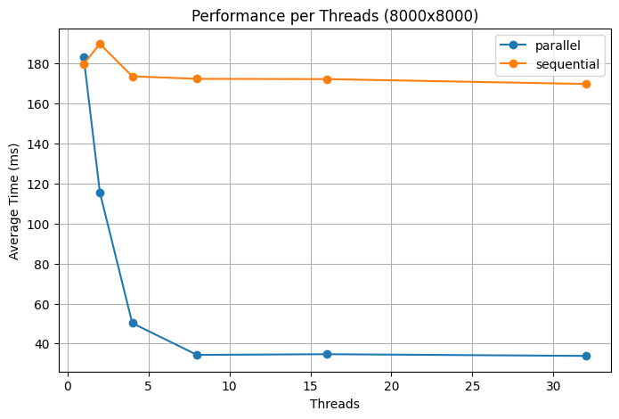
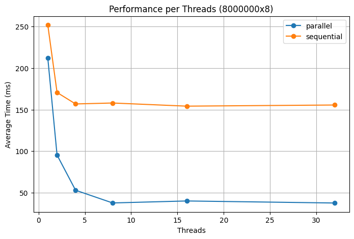
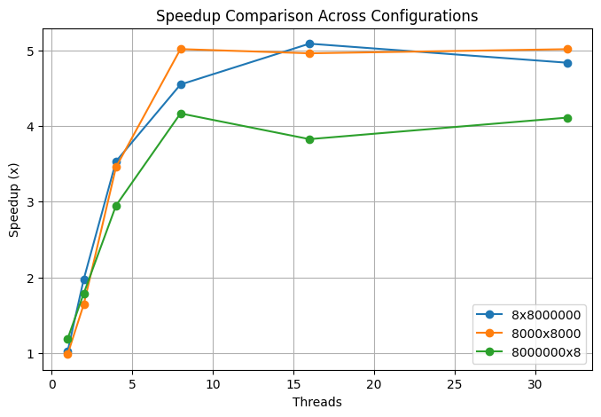
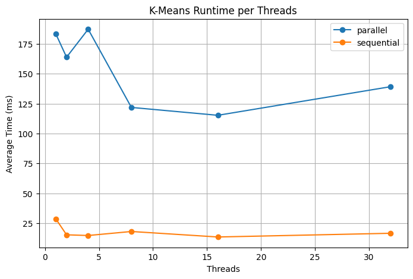
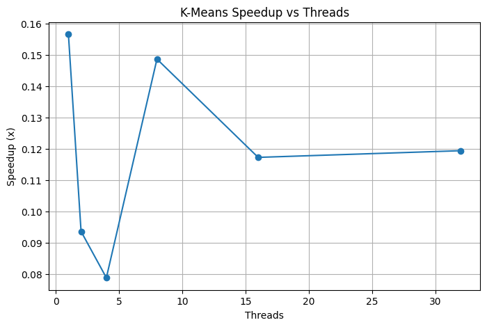
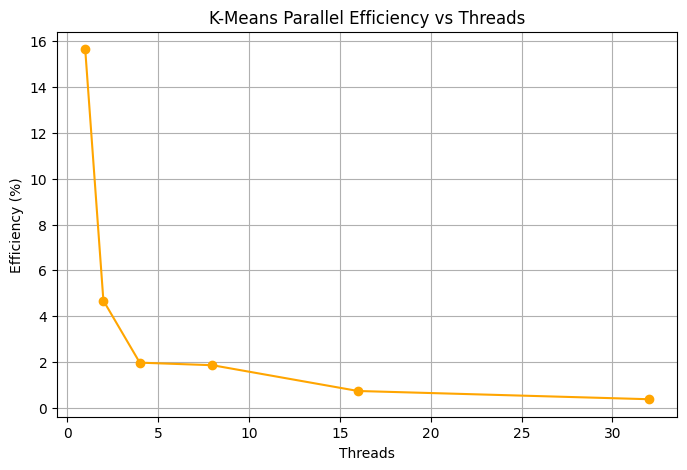
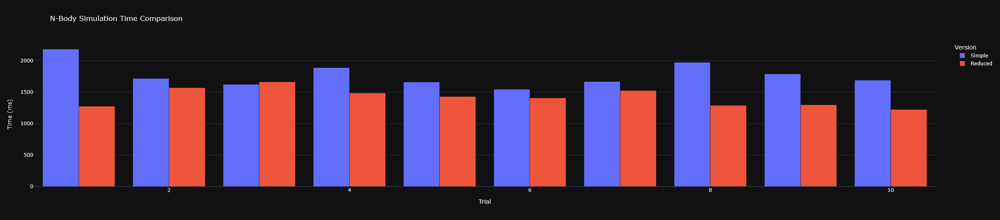
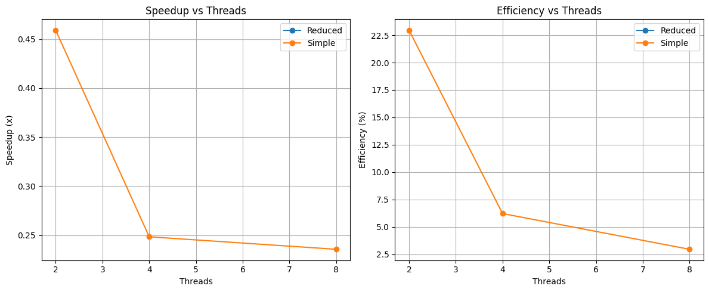

# Assignment: OpenMP

## Exercise 0: Parallel Trapezoidal Rule

To approximate the integral of a function `f(x)` over the interval `[a,b]` using the trapezoidal rule with `N` 
trapezoids and a step size `h = (b - a) / N`, the function f was implemented as:

```cpp
double f(const double x) {
    return 1.0 / (1.0 + x * x);
}
```

Based on this, the integral approximation function folloing the given equation can be implemented as:

```cpp
double trap(double a, double b, long long N, int num_threads) {
    double h = (b - a) / N;
    double sum = (f(a) + f(b)) / 2.0;

    for (long long i = 1; i < N; i++) {
        double x_i = a + i * h;
        sum += f(x_i);
    }

    sum *= h;
    return 4 * sum;
}
```

To parallelize this function using OpenMP, we can use the `#pragma omp parallel for` directive to distribute the loop
iterations across multiple threads. To ensure that the `sum` variable is updated correctly in a 
thread-safe way, a private variable for each thread is used and then combined at the end:

```cpp
double trap(double a, double b, long long N, int num_threads) {
    double h = (b - a) / N;
    double sum = (f(a) + f(b)) / 2.0;

    #pragma omp parallel for num_threads(num_threads) reduction(+:sum)
    for (long long i = 1; i < N; i++) {
        double x_i = a + i * h;
        sum += f(x_i);
    }

    sum *= h;
    return 4 * sum;
}
```

In this code, the `reduction(+:sum)` clause ensures that each thread has its own private copy of `sum`, and at the end
of the parallel region, these private copies are combined into the global `sum` by addition.

## Exercise 1: Parallel Matrix Multiplication

In the first step, the matrix multiplication is implemented in a sequential manner:

```cpp
double *multiplySequential(const double *A, const double *x, const int rows, const int cols) {
    auto *result = new double[rows];

    for (int i = 0; i < rows; i++) {
        double sum = 0.0;
        for (int j = 0; j < cols; j++) {
            sum += A[i * cols + j] * x[j];
        }

        result[i] = sum;
    }

    return result;
}
```

Here, `A` is a matrix with dimensions `rows x cols`, and `x` is a vector of size `cols`. The result is a vector 
of size `rows`.

To parallelize this matrix multiplication using OpenMP, `#pragma omp parallel for` can be used again to distribute
the outer loop iterations across multiple threads:

```cpp
double *multiplyParallel(const double *A, const double *x, const int rows, const int cols, int num_threads) {
    auto *result = new double[rows];

    #pragma omp parallel for num_threads(num_threads)
    for (int i = 0; i < rows; i++) {
        double sum = 0.0;
        for (int j = 0; j < cols; j++) {
            sum += A[i * cols + j] * x[j];
        }
        result[i] = sum;
    }

    return result;
}
```

In this parallel version, each thread computes the result for a subset of the rows of the matrix `A`, allowing for
concurrent execution and improved performance on multi-core processors. The number of threads can be specified using 
the `num_threads` parameter.

To test the performance of both the sequential and parallel implementations, both versions of the matrix multiplication
are run for 50 trials for various matrix sizes and number of threads.

```cpp
int main() {
    std::fstream out_file{"parallelMatrixMultiplication.csv", std::ios::out};
    write_header(out_file);

    const auto runIndex = new int(0);

    for (int numThreadsValues[] = {1, 2, 4, 8, 16, 32}; const int numThreads: numThreadsValues) {
        constexpr int trials = 50;

        runExperiment(8000000, 8, trials, numThreads, *runIndex, out_file);

        runExperiment(8000, 8000, trials, numThreads, *runIndex, out_file);

        runExperiment(8, 8000000, trials, numThreads, *runIndex, out_file);
    }

    delete runIndex;

    return 0;
}
```
When comparing the results, the following 3 graphs show the performance of the parallel and sequential matrix
multiplication for different matrix sizes and number of threads, it can be seen that the computation time can be
significantly reduced by running the matrix multiplication in parallel.

Across all tests, the parallel version is faster than the sequential version. The program was run on a relatively
weak laptop with 4 cores. Since only 4 cores are available, the speedup increases until the number of threads
reaches the number of cores. After that, the speedup stagnates or even decreases slightly due to the thread management
overhead.






Interestingly, in the case of a very high matrix (8000000x8), the parallel version falls behind the other experiments.
This could be due to the outer loop being too small, since the matrix only has 8 columns, increasing the overhead of
thread management compared to its usefulness.




## Exercise 2: Parallel K-Means Clustering

For the K-Means clustering algorithm, again a sequential implementation is created first. The algorithm contains the
following steps:

1. Initialize the samples
2. Initialize the centroids
3. Assign each sample to the closest centroid
4. Update the centroids
5. Repeat steps 3 and 4 until convergence

```cpp
double *initializeSamples() {
    auto *samples = new double[N * d];

    std::random_device rd;
    std::mt19937 gen(rd());
    std::uniform_real_distribution<double> cluster_center_dist(a, b);
    std::normal_distribution<double> cluster_spread(0.0, 10.0); // cluster spread controls tightness

    std::vector<std::array<double, d> > centers(K);
    for (int k = 0; k < K; ++k) {
        for (int j = 0; j < d; ++j) {
            centers[k][j] = cluster_center_dist(gen);
        }
    }

    for (int i = 0; i < N; ++i) {
        int cluster_id = i % K;
        for (int j = 0; j < d; ++j) {
            samples[i * d + j] = centers[cluster_id][j] + cluster_spread(gen);
        }
    }

    return samples;
}

double *initializeCentroids(const double *samples) {
    auto *centroids = new double[K * d];

    std::random_device rd;
    std::mt19937 gen(rd());
    std::uniform_int_distribution<int> dist(0, N - 1);

    for (int k = 0; k < K; k++) {
        const int idx = dist(gen);
        for (int j = 0; j < d; j++) {
            centroids[k * d + j] = samples[idx * d + j];
        }
    }

    return centroids;
}

void assignDataPointsToCentroids(const double *samples, const double *centroids, int *assignments,
                                 const int num_samples,
                                 const int num_centroids, const int dimensions) {
    for (int i = 0; i < num_samples; i++) {
        double min_distance = std::numeric_limits<double>::max();
        int closest_centroid = -1;

        for (int k = 0; k < num_centroids; k++) {
            double distance = 0.0;
            for (int j = 0; j < dimensions; j++) {
                const double diff = samples[i * dimensions + j] - centroids[k * dimensions + j];
                distance += diff * diff;
            }

            if (distance < min_distance) {
                min_distance = distance;
                closest_centroid = k;
            }
        }

        assignments[i] = closest_centroid;
    }
}

void updateCentroids(const double *samples, double *centroids, const int *assignments, const int num_samples,
                     const int num_centroids, const int dimensions) {
    std::vector counts(num_centroids, 0);
    std::vector new_centroids(num_centroids * dimensions, 0.0);

    for (int i = 0; i < num_samples; ++i) {
        const int cluster = assignments[i];
        counts[cluster]++;
        for (int j = 0; j < dimensions; ++j) {
            new_centroids[cluster * dimensions + j] += samples[i * dimensions + j];
        }
    }

    for (int k = 0; k < num_centroids; ++k) {
        if (counts[k] > 0) {
            for (int j = 0; j < dimensions; ++j) {
                centroids[k * dimensions + j] = new_centroids[k * dimensions + j] / counts[k];
            }
        }
    }
}

void runKMeansSequential(double *samples, double *centroids, int *assignments,
                         int num_samples, int num_centroids, int dimensions,
                         double tol = 1e-4) {
    std::vector<double> old_centroids(num_centroids * dimensions);

    for (int iter = 0; iter < max_iterations; iter++) {
        std::copy_n(centroids, num_centroids * dimensions, old_centroids.begin());

        assignDataPointsToCentroids(samples, centroids, assignments,
                                    num_samples, num_centroids, dimensions);

        updateCentroids(samples, centroids, assignments,
                        num_samples, num_centroids, dimensions);

        double shift = 0.0;
        for (int k = 0; k < num_centroids; k++) {
            for (int j = 0; j < dimensions; j++) {
                const double diff = centroids[k * dimensions + j] - old_centroids[k * dimensions + j];
                shift += diff * diff;
            }
        }
        if (shift < tol) break;
    }
}
```

To parallelize the assignment step, the `#pragma omp parallel for` directive can be used to distribute the loop
iterations across multiple threads:

```cpp
void assignDataPointsToCentroidsParallel(const double *samples, const double *centroids, int *assignments,
                                         const int num_samples,
                                         const int num_centroids, const int dimensions, const int num_threads) {
    #pragma omp parallel for num_threads(num_threads)
    for (int i = 0; i < num_samples; i++) {
        double min_distance = std::numeric_limits<double>::max();
        int closest_centroid = -1;

        for (int k = 0; k < num_centroids; k++) {
            double distance = 0.0;
            for (int j = 0; j < dimensions; j++) {
                const double diff = samples[i * dimensions + j] - centroids[k * dimensions + j];
                distance += diff * diff;
            }

            if (distance < min_distance) {
                min_distance = distance;
                closest_centroid = k;
            }
        }

        assignments[i] = closest_centroid;
    }
}
```

Again the perfomance of the parallel and sequential versions are compared. This time, the performance of the parallel
version is significantly worse than the sequential version. It is not entirely clear why this is the case, but it
could be due to a implementation error. Even after several attempts to optimize the parallel version, the performance
remained worse than the sequential version.







## Exercise 3: N-Body Simulation

The N-Body simulation is implemented in a sequential manner first. Forces are calculated in two versions, once using the
simple apporach and once using the reduced approach described in the assignment. The results can be seen in the 
jupyter notebook.

```cpp
void calculate_forces_simple(int q, Particle *particles, Vector *forces) {
    forces[q].X = forces[q].Y = forces[q].Z = 0.0;

    for (int k = 0; k < n_particles; k++) {
        if (k == q) continue;

        double dx = particles[q].s.X - particles[k].s.X;
        double dy = particles[q].s.Y - particles[k].s.Y;
        double dz = particles[q].s.Z - particles[k].s.Z;

        double r2 = dx * dx + dy * dy + dz * dz;
        double r1 = sqrt(r2);
        double r3 = r2 * r1;

        double mass_force = particles[k].m / r3;

        forces[q].X += mass_force * dx;
        forces[q].Y += mass_force * dy;
        forces[q].Z += mass_force * dz;
    }

    forces[q].X *= -G;
    forces[q].Y *= -G;
    forces[q].Z *= -G;
}

void calculate_forces_reduced(Particle *particles, Vector *forces) {
    for (int q = 0; q < n_particles; q++) {
        for (int k = q + 1; k < n_particles; k++) {
            double dx = particles[k].s.X - particles[q].s.X;
            double dy = particles[k].s.Y - particles[q].s.Y;
            double dz = particles[k].s.Z - particles[q].s.Z;

            double r2 = dx * dx + dy * dy + dz * dz;
            double r1 = sqrt(r2);
            double r3 = r2 * r1;

            double f = G * particles[q].m * particles[k].m / r3;

            double fx = f * dx;
            double fy = f * dy;
            double fz = f * dz;

            forces[q].X += fx;
            forces[q].Y += fy;
            forces[q].Z += fz;

            forces[k].X -= fx;
            forces[k].Y -= fy;
            forces[k].Z -= fz;
        }
    }
}
```

Comparing the performance of the simple and reduced approach, the reduced approach is consistently faster.



To parallelize the calculation of the forces (at least for the simple version), the `#pragma omp parallel for`
directive can be used to distribute the loop iterations across multiple threads:

```cpp
void run_simulation_simple_parallel(int thread_num) {
    auto *particles = new Particle[n_particles];
    generate_initial_state(particles);

    std::ofstream out_file{"n_body_simple.csv", std::ios::out};
    write_header(out_file);
    write_state(out_file, 0, 0.0, particles);

    auto *forces = new Vector[n_particles];

    for (int step = 1; step <= n_steps; step++) {
        double current_time = step * delta_t;

        // calculate forces
        #pragma omp parallel for num_threads(thread_num)
        for (int q = 0; q < n_particles; q++) {
            calculate_forces_simple(q, particles, forces);
        }

        // position updates
        for (int q = 0; q < n_particles; q++) {
            update_position(q, particles, forces);
        }

        // write results
        if (step % 100 == 0) {
            write_state(out_file, step, current_time, particles);
        }
    }

    delete[] particles;
    delete[] forces;
}
```



Again, the performance is not improved by using multiple threads, but actually worse.
